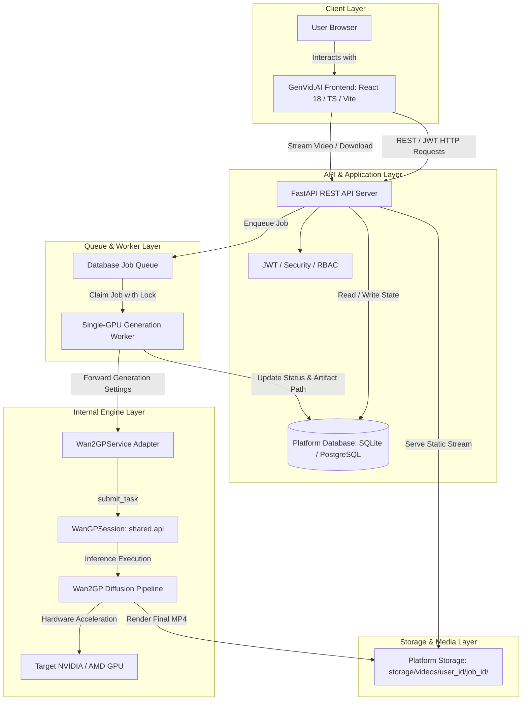

# GenVid.AI — Multi-User AI Video Generation Platform

> **AI Video Generation, Reimagined.**  
> A custom multi-user SaaS platform built on top of the open-source **Wan2GP** diffusion engine.

---

## 📋 Overview

**GenVid.AI** is a standalone web platform designed for generative video workflows. It provides an independent user interface, user authentication, role-based access control (RBAC), job queue management, video storage isolation, and video playback/download capabilities.

Internally, the platform integrates directly with the **Wan2GP** generation engine in-process (`shared.api`), delegating low-level model loading, tensor processing, diffusion sampling loops, and GPU hardware acceleration to the engine without exposing Wan2GP's internal Gradio UI or technical mechanics to normal users.

### Architectural Positioning

```
USER
  ↓
CUSTOM PLATFORM UI (React + TypeScript + Tailwind)
  ↓
CUSTOM PLATFORM BACKEND (FastAPI + SQLAlchemy + JWT)
  ↓
DATABASE-BACKED GENERATION QUEUE & WORKER
  ↓
WAN2GP INTEGRATION LAYER (Wan2GPService / shared.api)
  ↓
WAN2GP ENGINE RUNTIME
  ↓
AI VIDEO MODEL & GPU INFERENCE
  ↓
GENERATED MP4 VIDEO
  ↓
PLATFORM ISOLATED STORAGE (videos/{user_id}/{job_id}/)
  ↓
CUSTOM PLATFORM MEDIA PLAYER & DOWNLOAD
  ↓
USER
```

---

## 🌟 Key Features

### 🎨 User Experience & Studio
- **Modern Studio Workspace:** Clean prompt canvas with prompt inspiration ideas, hyperparameter controls, and instant output previews.
- **Dynamic Model Discovery:** Real-time discovery of supported video models from the underlying engine, distinguishing between models with ready checkpoints vs. missing weights.
- **Configurable Parameters:** Fine-tune video length (frames), sampling steps, and randomized or fixed seeds.
- **Live Generation Progress:** Real-time polling with progress percentages, active phase tracking (`denoising`, `rendering`), and step counters (`Step X/Y`).
- **Media Player & Direct Download:** Built-in video player with instant MP4 playback and one-click download.
- **Personal Video History:** Searchable and filterable generation archive scoped exclusively to the authenticated user.

### 🛡️ Platform & Security
- **User Authentication:** Secure registration and login using JWT access/refresh tokens and bcrypt password hashing.
- **Role-Based Access Control (RBAC):** Tiered permissions supporting `admin`, `manager`, and `user` roles.
- **Admin Control Center:** User account registry, role assignment, account activation/deactivation, and password reset workflows.
- **Asynchronous DB-Backed Queue:** Background worker that claims queued jobs sequentially with row locking, preventing GPU contention.
- **Storage Isolation:** Generated media is strictly mapped to `user_id`/`job_id` paths to prevent unauthorized access across tenants.
- **Sanitized Error Handling:** Automatic abstraction of raw CUDA/Python stack traces into actionable application alerts.

### ⚡ AI Engine & Hardware Awareness
- **In-Process Wan2GP Integration:** High-performance direct Python API integration using `shared.api.init()`, `WanGPSession`, `submit_task()`, and `SessionJob.result()`.
- **System Health Monitor:** Real-time diagnostics monitoring API latency, database connection, GPU VRAM allocation, and engine status.

---

## 🏗️ Architecture



---

## 🔄 End-to-End Generation Flow

1. **User Authentication:** User signs in via `/login` and receives a secure JWT token.
2. **Model Selection & Prompting:** User navigates to `/dashboard/videos`, selects a ready model dynamically reported by `/api/v1/generations/models`, and inputs a prompt.
3. **Job Creation:** The frontend dispatches `POST /api/v1/generations`. The backend validates settings, creates a `GenerationJob` with status `QUEUED`, and triggers the worker.
4. **Queue Pick-up:** The `GenerationWorker` claims the next queued task, updates status to `PROCESSING`, and dispatches the task to `Wan2GPService`.
5. **Engine Inference:** `WanGPSession.submit_task()` executes the generation pipeline. Progress events (current step, total steps, phase) are streamed back to the database.
6. **Output Archival:** On completion, the generated MP4 is moved to `storage/videos/{user_id}/{job_id}/output.mp4` and the job is marked `COMPLETED`.
7. **Playback & Retrieval:** The user views the rendered video directly within the studio player or downloads the MP4 file.

---

## 📁 Repository Structure

```
Wan2GP/
├── backend/                        # FastAPI Application Core
│   ├── app/
│   │   ├── api/                    # REST API Route Handlers
│   │   │   ├── admin.py            # User management & administration
│   │   │   ├── auth.py             # Login, register, token refresh
│   │   │   ├── generations.py      # Job submission, history, video streaming
│   │   │   └── health.py           # Database, GPU, and engine health diagnostics
│   │   ├── core/                   # Security, dependencies, RBAC
│   │   ├── db/                     # Database session & models
│   │   ├── models/                 # SQLAlchemy models (User, GenerationJob, Role)
│   │   ├── schemas/                # Pydantic request/response schemas
│   │   ├── services/               # Business logic & Worker
│   │   │   ├── generation_worker.py # DB queue worker & progress persister
│   │   │   └── wan2gp_service.py   # Adapter for Wan2GP shared.api
│   │   ├── config.py               # Settings & environment variables
│   │   └── main.py                 # FastAPI application factory & lifespan
│   ├── tests/                      # Automated pytest suite (16 tests)
│   └── requirements.txt            # Python dependencies
│
├── frontend/                       # GenVid.AI Single Page Application
│   ├── src/
│   │   ├── components/             # AppLayout, HealthStatus, ToastContainer, ProtectedRoute
│   │   ├── pages/                  # Landing, Login, Register, Dashboard, Generation, History, Admin, Profile
│   │   ├── services/               # Axios API client
│   │   ├── store/                  # Zustand state stores (auth, toast)
│   │   ├── App.tsx                 # Routing & layout configuration
│   │   └── main.tsx                # React entrypoint
│   ├── package.json                # Frontend dependencies
│   └── vite.config.ts              # Vite configuration
│
├── shared/                         # Wan2GP Internal Engine
│   ├── api.py                      # In-process WanGPSession API
│   ├── api_cli.py                  # CLI task execution runner
│   └── model_dropdowns.py          # Model file status & discovery logic
│
└── README.md                       # Project documentation
```

---

## ⚙️ Configuration & Environment Variables

Create a `.env` file inside `backend/` or export the variables in your environment:

| Variable | Default | Description |
|---|---|---|
| `WAN2GP_ROOT` | Repository Root | Absolute path to the Wan2GP root directory containing `shared/` and model definitions |
| `STORAGE_PATH` | `./generated_videos` | Filesystem directory where generated MP4 videos are archived |
| `DATABASE_URL` | `sqlite:///./wangp.db` | SQLAlchemy connection string (`postgresql://...` or `sqlite:///...`) |
| `JWT_SECRET_KEY` | Auto-generated | Secret key used for signing JWT authentication tokens |
| `BACKEND_HOST` | `0.0.0.0` | API bind address |
| `BACKEND_PORT` | `8000` | API port |
| `FRONTEND_URL` | `http://localhost:5173` | Allowed frontend origin for CORS |
| `GENERATION_WORKER_POLL_SECONDS` | `1.0` | Polling frequency for queue worker |

---

## 🚀 Getting Started

### Prerequisites
- **Python:** 3.10, 3.11, or 3.12+
- **Node.js:** 18+ and `npm`
- **GPU Hardware:** NVIDIA GPU with CUDA support (or compatible AMD ROCm environment)

### 1. Backend Setup

```bash
# Navigate to repository root
cd Wan2GP

# Create and activate virtual environment
python -m venv venv
# On Windows:
.\venv\Scripts\activate
# On Linux/macOS:
source venv/bin/activate

# Install backend dependencies
pip install -r backend/requirements.txt

# Start backend server
python -m uvicorn app.main:app --app-dir backend --host 0.0.0.0 --port 8000 --reload
```

The API docs are accessible at: `http://localhost:8000/docs`

### 2. Frontend Setup

```bash
# Navigate to frontend directory
cd Wan2GP/frontend

# Install dependencies
npm install

# Start development server
npm run dev
```

Open your browser at: `http://localhost:5173`

---

## 🧪 Testing & Verification

### Run Backend Tests
```bash
pytest backend/tests
```

### Run Frontend Type Checking & Build
```bash
cd frontend
npm run type-check
npm run build
```

---

## 🔒 Security & User Isolation

- **Role Separation:** Regular users can only see and cancel their own jobs. Admin users have access to system-wide metrics and user moderation tools.
- **Storage Safety:** Path traversal attacks are mitigated by resolving output files strictly against `STORAGE_PATH`.
- **Sanitized Execution:** Users provide high-level parameters (prompt, frames, steps, seed) rather than raw filesystem paths or executable commands.

---

## 📄 License & Attribution

- **Platform Code (UI, Backend, Queue, API):** Proprietary / Custom Platform.
- **Underlying Engine (Wan2GP):** Open-source generative engine created by DeepBeepMeep.
