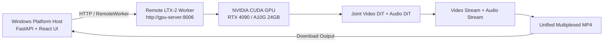

# Lightricks LTX-2 Multimodal Audio-Video Engine Integration Guide

> **Audit status: NOT APPROVED.** This guide contains historical integration claims that are not verified against the requested upstream revision. Do not use its checkpoint list, 16 GB VRAM statement, Windows support statement, or first-frame/continuity claims as production requirements. The supplied Lightricks/LTX-2 revision `9c58ea4f8b2d1891a329d2b700efc164a66391d7` does not resolve in the official public GitHub repository; tag/release `v0.9.1` is also absent. See [ltx-2-dependencies.md](ltx-2-dependencies.md) and [ltx-2-capability-matrix.md](ltx-2-capability-matrix.md). No production pipeline is approved by this audit.

## 1. Engine Overview

**LTX-2** is an advanced multimodal joint Audio-Video Latent Diffusion Transformer (DiT) foundation model developed by Lightricks. Unlike pure visual video models, LTX-2 simultaneously models temporal video latents and acoustic audio latents in a shared or dual-stream architecture, producing synchronized cinematic video along with natural ambient soundscapes, foley, sound effects, and musical soundtrack.

* **Supported Modes**: Text-to-Video (T2V), Image-to-Video (I2V / Level 2 Visual Continuity), and Joint Audio-Video Synthesis
* **Audio Capabilities**: Generates synchronized ambient soundscapes, soundtrack, and environmental audio aligned with video motions. (Character dialogue and persistent multi-character speech remain powered by the platform's Edge TTS and dialogue pipeline)
* **Engine ID**: `ltx-2`
* **Adapter**: `app.engines.ltx2_adapter.LTX2Adapter`
* **Worker**: `app.workers.ltx2_worker.LTX2GPUWorker` / `app.workers.standalone_ltx2_server`

---

## 2. Upstream Architecture & Components

* **Upstream Project**: Lightricks LTX-2 ([DeepBeepMeep/LTX-2 on Hugging Face](https://huggingface.co/DeepBeepMeep/LTX-2))
* **Base Architecture**: 19B / 22B parameter dual-stream DiT (14B Video Transformer + 5B Audio Transformer)
* **Text Conditioning**: Google Gemma (`gemma-3-12b-it-qat-q4_0-unquantized.safetensors` or `gemma4-12b-ltx-v1`) with unified multimodal AV projections (`av_encoder.py`)
* **Video Autoencoder**: Lightricks 3D Causal Video VAE (`ltx-2-19b_vae.safetensors` or PrunaAI/NAD VAE)
* **Audio Autoencoder & Vocoder**: Lightricks 2D Causal Audio VAE (`ltx-2-19b_audio_vae.safetensors`) and Neural Vocoder (`ltx-2-19b_vocoder.safetensors`)
* **Primary Checkpoints**:
  * `ltx-2-19b-av`: 40 inference steps, 4.5 guidance, full joint Audio-Video foundation DiT.
  * `ltx-2-distilled`: 8 inference steps, 1.0 guidance, low-latency fast DiT.
  * `ltx-2.3-av`: 50 inference steps, 5.0 guidance, high-fidelity production AV model.

---

## 3. Hardware & System Requirements

| Requirement | Minimum | Recommended |
| :--- | :--- | :--- |
| **GPU** | NVIDIA RTX 3080 / 4070 Ti (16 GB VRAM) | NVIDIA RTX 3090 / 4090 / A10G / A100 (24 GB - 80 GB) |
| **VRAM** | 16.0 GB (with CPU offload and Quanto quantization) | 24.0 GB+ (resident VRAM) |
| **CUDA** | CUDA 12.1 or 12.4 | CUDA 12.4 |
| **NVIDIA Driver** | $\ge 535.xx$ | $\ge 550.xx$ |
| **Host OS** | Windows 10/11, Ubuntu 22.04 LTS, WSL2 | Linux (Ubuntu 22.04 LTS) |
| **System RAM** | 32 GB | 64 GB |
| **Disk Storage** | 40 GB free space | 100 GB free space |

---

## 4. Setup Procedure for GPU Owners

### Step 1: Clone Repository & Create Virtual Environment
```bash
git clone https://github.com/ShoaibAbrar/AI_VIDEO_GEN.git
cd AI_VIDEO_GEN

python -m venv .venv
# On Windows:
.venv\Scripts\activate
# On Linux:
source .venv/bin/activate
```

### Step 2: Install PyTorch with CUDA 12.4
```bash
pip install torch torchvision torchaudio --index-url https://download.pytorch.org/whl/cu124
pip install -r backend/requirements.txt
pip install transformers accelerate diffusers soundfile sentencepiece protobuf
```

### Step 3: Model Checkpoints Configuration

Place model weights into `models/ltx2/`:
```text
models/
  ltx2/
    configs/
      ltx2_19b_config.json
    ltx-2-19b_vae.safetensors
    ltx-2-19b_audio_vae.safetensors
    ltx-2-19b_vocoder.safetensors
    gemma-3-12b-it-qat-q4_0-unquantized.safetensors
```

Set environment variable:
```bash
# Windows PowerShell
$env:LTX2_CHECKPOINTS_DIR = "F:\Internship\Wan2GP\models\ltx2"

# Linux / WSL2
export LTX2_CHECKPOINTS_DIR="/path/to/models/ltx2"
```

---

## 5. Starting the LTX-2 Audio-Video Worker

### Windows (Local Dedicated Worker):
```powershell
.\scripts\start-ltx2-worker.ps1 -Port 8006
```

### Linux / WSL2 / Remote Cloud GPU Server:
```bash
bash scripts/start-ltx2-worker.sh 0.0.0.0 8006
```

The worker service listens on `http://0.0.0.0:8006`:
* `GET /health`: Returns GPU VRAM telemetry, CUDA status, and model discovery.
* `POST /generate`: High-performance joint Audio-Video inference with step progress reporting.

---

## 6. Remote GPU Architecture

When developing on a non-GPU PC, configure the platform backend to route to a remote LTX-2 GPU instance:



In `.env`:
```env
GPU_WORKER_TYPE=REMOTE
REMOTE_WORKER_ENDPOINT=http://<gpu-ip>:8006
```

---

## 7. Diagnostics & Status Codes

* `READY`: CUDA GPU ($\ge 16$ GB VRAM), Gemma text encoders, Video VAE, and Audio Vocoder verified.
* `CUDA_UNAVAILABLE`: Local machine lacks NVIDIA CUDA GPU.
* `DEPENDENCY_MISSING`: `torch`, `transformers`, `accelerate`, or `soundfile` missing.
* `MODEL_MISSING`: Checkpoint files not found in `models/ltx2/`.
* `INSUFFICIENT_VRAM`: Host GPU has $< 16$ GB VRAM.
* `MOCK`: Running in `DEV_MOCK_ENGINE=true` simulation mode.

---

## 8. Level 2 Visual Continuity Support

LTX-2 supports first-frame conditioning (`image_start`):
1. `MediaStitcher.extract_last_frame` captures Scene $N$'s final frame.
2. The orchestrator forwards `image_start` into `LTX2GenerationRequest`.
3. `LTX2InferenceRunner` feeds the image into the `ti2vid` conditioning stream, ensuring visual and temporal continuity across scenes.
