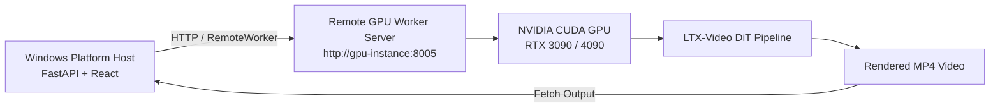

# Lightricks LTX-Video Engine Integration Guide

## 1. Engine Overview

**LTX-Video** is a high-throughput, low-latency Latent Diffusion Transformer (DiT) video generation foundation model developed by Lightricks. It renders high-definition, high-frame-rate videos significantly faster than traditional 3D U-Net video models through efficient spatio-temporal causal patchification and transformer self-attention blocks.

* **Supported Modes**: Text-to-Video (T2V) and Image-to-Video (I2V / Level 2 Visual Continuity)
* **Audio**: Pure visual video synthesis (Dialogue and sound effects are synthesized and composited via the platform's TTS and FFmpeg pipeline)
* **Engine ID**: `ltx-video`
* **Adapter**: `app.engines.ltx_video_adapter.LTXVideoAdapter`
* **Worker**: `app.workers.ltx_worker.LTXGPUWorker` / `app.workers.standalone_ltx_server`

---

## 2. Upstream Repository & Components

* **Official Repository**: [https://github.com/Lightricks/LTX-Video](https://github.com/Lightricks/LTX-Video)
* **Model Hub**: [Lightricks/LTX-Video on Hugging Face](https://huggingface.co/Lightricks/LTX-Video)
* **Inference Pipeline API**: Native `diffusers.LTXPipeline` (Text-to-Video) and `diffusers.LTXImageToVideoPipeline` (Image-to-Video)
* **Primary Checkpoint Variants**:
  * `ltx-video-0.9.8-distilled`: 8 inference steps, 1.0 guidance scale, ultra-high throughput.
  * `ltx-video-0.9.5`: 30 inference steps, 3.0 guidance scale, high-detail foundation DiT.
  * `ltx-video-2b`: 25 inference steps, lightweight 2B parameter variant.

---

## 3. Hardware & System Requirements

| Requirement | Minimum | Recommended |
| :--- | :--- | :--- |
| **GPU** | NVIDIA RTX 3060 / 4060 (12 GB) | NVIDIA RTX 3090 / 4090 / A10G / A100 (24 GB+) |
| **VRAM** | 12.0 GB (with CPU offload enabled) | 24.0 GB (pure VRAM resident) |
| **CUDA** | CUDA 11.8+ | CUDA 12.1 or 12.4 |
| **NVIDIA Driver** | $\ge 535.xx$ | $\ge 550.xx$ |
| **Host OS** | Windows 10/11, Ubuntu 22.04+, WSL2 | Linux (Ubuntu 22.04 LTS) |
| **System RAM** | 16 GB | 32 GB+ |
| **Disk Storage** | 20 GB free space | 50 GB free space |

---

## 4. Setup Procedure for GPU Owners

### Step 1: Clone Repository & Create Environment
```bash
git clone https://github.com/ShoaibAbrar/AI_VIDEO_GEN.git
cd AI_VIDEO_GEN

# Create dedicated virtual environment
python -m venv .venv
# On Windows:
.venv\Scripts\activate
# On Linux:
source .venv/bin/activate
```

### Step 2: Install PyTorch with CUDA Acceleration
```bash
# For CUDA 12.4:
pip install torch torchvision --index-url https://download.pytorch.org/whl/cu124
# For CUDA 12.1:
pip install torch torchvision --index-url https://download.pytorch.org/whl/cu121
```

### Step 3: Install Required Dependencies
```bash
pip install -r backend/requirements.txt
pip install diffusers transformers accelerate sentencepiece protobuf imageio-ffmpeg
```

### Step 4: Model Checkpoints Configuration

You can either configure automatic Hugging Face hub caching or download weights locally into `models/ltx_video/`:

#### Option A: Automatic Hugging Face Download (Recommended)
Set environment variable:
```bash
# Windows PowerShell
$env:LTX_VIDEO_ALLOW_HF_DOWNLOAD = "1"
$env:LTX_VIDEO_HF_MODEL_ID = "Lightricks/LTX-Video"

# Linux / WSL2
export LTX_VIDEO_ALLOW_HF_DOWNLOAD=1
export LTX_VIDEO_HF_MODEL_ID="Lightricks/LTX-Video"
```

#### Option B: Manual Checkpoint Download
Download `ltx-video-2b-v0.9.safetensors` or `ltx-video-2b-v0.9.5.safetensors` from Hugging Face into:
```text
models/
  ltx_video/
    ltx-video-2b-v0.9.safetensors
```
Set environment variable:
```bash
# Windows PowerShell
$env:LTX_VIDEO_CHECKPOINTS_DIR = "F:\Internship\Wan2GP\models\ltx_video"

# Linux / WSL2
export LTX_VIDEO_CHECKPOINTS_DIR="/path/to/models/ltx_video"
```

---

## 5. Starting the LTX-Video Worker

### Windows (Local Dedicated Worker):
```powershell
.\scripts\start-ltx-video-worker.ps1 -Port 8005
```

### Linux / WSL2 / Cloud GPU Server:
```bash
bash scripts/start-ltx-video-worker.sh 0.0.0.0 8005
```

The worker starts an HTTP/FastAPI service on `http://0.0.0.0:8005` exposing:
* `GET /health`: Real-time VRAM, GPU name, CUDA version, model status.
* `POST /generate`: High-performance LTX inference with step progress reporting.

---

## 6. Remote GPU Architecture

If you develop on a Windows machine without an NVIDIA GPU, you can connect the platform backend to a remote Linux GPU worker (e.g. RunPod, AWS EC2, or local WSL2):



In `.env`:
```env
GPU_WORKER_TYPE=REMOTE
REMOTE_WORKER_ENDPOINT=http://<gpu-ip>:8005
```

---

## 7. Diagnostics & Status Codes

When checking runtime status via `engine.get_runtime_status()`, the platform returns exact diagnostic states:

* `READY`: CUDA GPU, PyTorch, Diffusers, and model weights are verified and ready for generation.
* `CUDA_UNAVAILABLE`: Local machine lacks an NVIDIA GPU (triggers remote worker requirement).
* `DEPENDENCY_MISSING`: `torch`, `diffusers`, or `transformers` is missing.
* `MODEL_MISSING`: Checkpoint files not found in `models/ltx_video` and Hugging Face download is disabled.
* `INSUFFICIENT_VRAM`: Host GPU has $< 12$ GB VRAM.
* `MOCK`: Platform is running in `DEV_MOCK_ENGINE=true` simulation mode.

---

## 8. Level 2 Visual Continuity Support

LTX-Video supports first-frame conditioning for multi-scene narrative chaining:
* The platform's `MediaStitcher` extracts the final frame of Scene $N$ as a PNG image (`scene_N_last_frame.png`).
* The orchestrator passes `image_start=<path>` into the LTX-Video generation payload.
* `LTXVideoInferenceRunner` resizes and feeds the start frame into `LTXImageToVideoPipeline`, maintaining visual consistency across scene boundaries.
