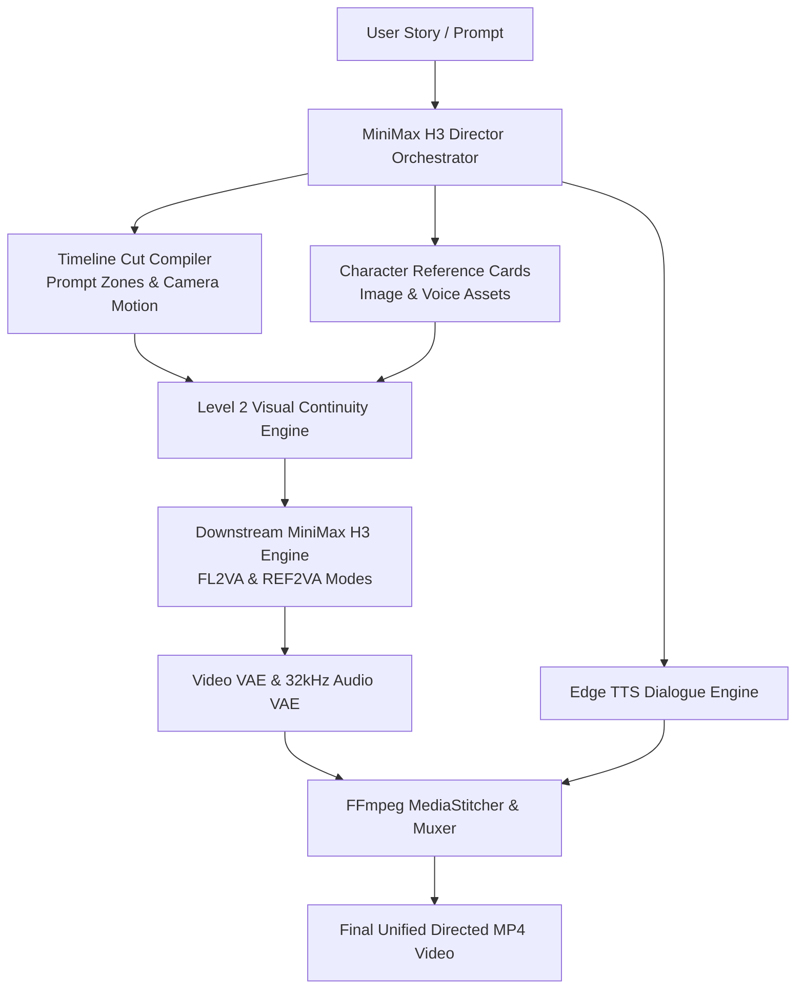

# MiniMax H3 Director Multi-Character Narrative Engine Guide

## 1. Engine Overview

**MiniMax H3 Director** (based on [muse-collective-26/MiniMaxH3-Director-V1.2](https://github.com/muse-collective-26/MiniMaxH3-Director-V1.2) and related ComfyUI orchestration nodes) is a high-level narrative director and visual scripting engine for multi-shot, multi-character generative cinematic sequences.

Unlike a standalone neural base model, H3 Director functions as an intelligent timeline orchestration and directing system. It coordinates:
1. **Multi-Cut Timeline Scripting**: Compiles user stories and scenes into structured narrative cuts (`DirectorShotCut`) with automated camera directives, timing windows, and prompt zoning.
2. **Character Reference Cards**: Binds facial, stylistic, and voice reference assets to specific characters, maintaining character identity across scene cuts.
3. **Level 2 Visual Continuity**: Extracts the final frame of Cut $N$ via FFmpeg and supplies it as `image_start` (`FL2VA` mode) to Cut $N+1$, ensuring visual and spatial consistency across shot transitions.
4. **Downstream Engine Execution**: Directly delegates diffusion passes to **MiniMax H3** (`T2VA`, `FL2VA`, `REF2VA`).
5. **Acoustic & Voice Synthesis**: Combines native 32kHz H3 stereo soundtrack and foley with Edge TTS dialogue.
6. **Timeline Assembly**: Multiplexes and stitches all generated cuts into a unified continuous MP4.

* **Engine ID**: `minimax-h3-director`
* **Adapter**: `app.engines.minimax_h3_adapter.MiniMaxH3DirectorAdapter`
* **Worker**: `app.workers.minimax_h3_director_worker.MiniMaxH3DirectorGPUWorker` / `app.workers.standalone_minimax_h3_director_server`

---

## 2. Upstream Architecture & Dependency Graph



---

## 3. Hardware & System Requirements

| Requirement | Minimum | Recommended |
| :--- | :--- | :--- |
| **GPU** | NVIDIA RTX 3090 / 4090 (24 GB VRAM) | NVIDIA A100 (40GB/80GB) / H100 / RTX 6000 Ada (48 GB+) |
| **VRAM** | 24.0 GB (Quantized downstream H3) | 48.0 GB+ (Resident downstream H3) |
| **CUDA** | CUDA 12.1 or 12.4 | CUDA 12.4 |
| **Host OS** | Ubuntu 22.04 LTS, WSL2, or Windows (Remote Worker) | Linux (Ubuntu 22.04 LTS) |
| **System RAM** | 32 GB | 64 GB |
| **FFmpeg** | Required on system PATH | Required |

---

## 4. Setup Procedure for GPU Owners

### Step 1: Clone Repository & Create Virtual Environment
```bash
git clone https://github.com/ShoaibAbrar/AI_VIDEO_GEN.git
cd AI_VIDEO_GEN

python -m venv .venv
source .venv/bin/activate  # on Windows: .venv\Scripts\activate
```

### Step 2: Install PyTorch & Dependencies
```bash
pip install torch torchvision torchaudio --index-url https://download.pytorch.org/whl/cu124
pip install -r backend/requirements.txt
pip install "git+https://github.com/huggingface/diffusers.git@minimax-h3" transformers accelerate soundfile
```

### Step 3: Start the H3 Director GPU Worker
```bash
# On Linux / WSL2:
bash scripts/start-minimax-h3-director-worker.sh 0.0.0.0 8008

# On Windows:
.\scripts\start-minimax-h3-director-worker.ps1 -Port 8008
```

The worker service listens on `http://0.0.0.0:8008`:
* `GET /health`: Reports GPU VRAM, CUDA, and downstream MiniMax H3 availability.
* `GET /capabilities`: Returns multi-character narrative capabilities.
* `GET /diagnostics`: Returns granular environment inspection.
* `POST /generate`: Multi-cut timeline planning, generation, and stitching.
* `GET /status/{job_id}`: Job execution telemetry.
* `POST /cancel/{job_id}`: Signals job cancellation.
* `GET /output/{job_id}`: Downloads final generated MP4 sequence.

---

## 5. Diagnostics & Status Codes

* `READY`: CUDA GPU ($\ge 24$ GB VRAM), FFmpeg, downstream MiniMax H3, and weights verified.
* `CUDA_UNAVAILABLE`: Local machine lacks NVIDIA CUDA GPU.
* `DOWNSTREAM_ENGINE_UNAVAILABLE`: Downstream MiniMax H3 checkpoints or dependencies missing.
* `DEPENDENCY_MISSING`: `torch`, `diffusers`, `transformers`, `soundfile`, or `ffmpeg` missing.
* `INSUFFICIENT_VRAM`: Host GPU has $< 24$ GB VRAM.
* `MOCK`: Running in `DEV_MOCK_ENGINE=true` simulation mode.
* `GPU_UNVERIFIED`: Host environment present, pending physical CUDA execution.
