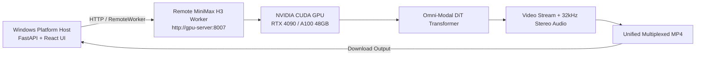

# MiniMax H3 Multimodal Omni-AV Engine Integration Guide

## 1. Engine Overview

**MiniMax H3** (Hailuo 3 / Hailuo H3) is an open-weight multimodal foundation model developed by MiniMax AI ([MiniMax-AI/MiniMax-H3](https://github.com/MiniMax-AI/MiniMax-H3) and [MiniMaxAI/MiniMax-H3 on Hugging Face](https://huggingface.co/MiniMaxAI/MiniMax-H3)).

Unlike traditional cascaded pipelines, MiniMax H3 uses an Omni-modal 33B / 20B Latent Diffusion Transformer (DiT) that jointly synthesizes cinematic video frames along with synchronized 32kHz stereo acoustic waveforms in a single unified diffusion forward pass.

* **Supported Modes**:
  * `T2VA` (Text-to-Video-Audio): Synthesizes video and stereo soundscapes from text prompts.
  * `FL2VA` (First/Last-frame to Video-Audio): Uses first-frame (`image_start`) and/or last-frame (`image_end`) anchor images for visual continuity.
  * `REF2VA` (Reference-to-Video-Audio): Accepts multi-modal conditioning (up to 9 reference images, reference audio clips, or reference video clips) for style and subject guidance.
* **Audio Capabilities**: Generates native 32kHz synchronized stereo ambient audio, foley, and soundtrack. (Character dialogue and persistent multi-character speech remain powered by the platform's Edge TTS and dialogue pipeline)
* **Engine ID**: `minimax-h3`
* **Adapter**: `app.engines.minimax_h3_adapter.MiniMaxH3Adapter`
* **Worker**: `app.workers.minimax_h3_worker.MiniMaxH3GPUWorker` / `app.workers.standalone_minimax_h3_server`

---

## 2. Upstream Architecture & Components

* **Official Repository**: `https://github.com/MiniMax-AI/MiniMax-H3`
* **Hugging Face Hub**: `https://huggingface.co/MiniMaxAI/MiniMax-H3`
* **Base Architecture**: 33B / 20B Omni-Modal Transformer with AdaLN-zero modulation
* **Text / Multimodal Conditioning**: Qwen3-VL text encoder & multimodal processor (`transformers>=4.45.0`)
* **Video Autoencoder**: 3D Causal Video VAE
* **Audio Autoencoder**: 2D Causal Audio VAE & Neural Vocoder (32kHz stereo)
* **Inference Entry Point**: `diffusers.ModularPipeline.from_pretrained("MiniMaxAI/MiniMax-H3")` or `diffusers.DiffusionPipeline`

---

## 3. Hardware & System Requirements

| Requirement | Minimum (Quantized / Low-VRAM) | Recommended (Resident FP16) |
| :--- | :--- | :--- |
| **GPU** | NVIDIA RTX 3090 / 4090 / A5000 (24 GB VRAM) | NVIDIA A100 (40GB/80GB) / H100 / RTX 6000 Ada (48 GB+) |
| **VRAM** | 24.0 GB (with FP8 / GGUF quantization & CPU offload) | 48.0 GB+ |
| **CUDA** | CUDA 12.1 or 12.4 | CUDA 12.4 |
| **NVIDIA Driver** | $\ge 535.xx$ | $\ge 550.xx$ |
| **Host OS** | Ubuntu 22.04 LTS, WSL2, or Windows (Remote Worker) | Linux (Ubuntu 22.04 LTS) |
| **System RAM** | 32 GB | 64 GB - 128 GB |
| **Disk Storage** | 60 GB free space | 120 GB free space |

---

## 4. Setup Procedure for GPU Owners

### Step 1: Clone Repository & Create Virtual Environment
```bash
git clone https://github.com/ShoaibAbrar/AI_VIDEO_GEN.git
cd AI_VIDEO_GEN

python -m venv .venv
# On Windows:
.venv\Scripts\activate
# On Linux:
source .venv/bin/activate
```

### Step 2: Install PyTorch with CUDA 12.4 & Dependencies
```bash
pip install torch torchvision torchaudio --index-url https://download.pytorch.org/whl/cu124
pip install -r backend/requirements.txt
pip install "git+https://github.com/huggingface/diffusers.git@minimax-h3" transformers accelerate soundfile sentencepiece protobuf
```

### Step 3: Model Checkpoints Configuration
Place model checkpoints into `models/minimax_h3/`:
```text
models/
  minimax_h3/
    model_index.json
    transformer/
      diffusion_pytorch_model.safetensors
    text_encoder/
      model.safetensors
    video_vae/
      diffusion_pytorch_model.safetensors
    audio_vae/
      diffusion_pytorch_model.safetensors
```

Set environment variable:
```bash
# Windows PowerShell
$env:MINIMAX_H3_CHECKPOINTS_DIR = "F:\Internship\Wan2GP\models\minimax_h3"

# Linux / WSL2
export MINIMAX_H3_CHECKPOINTS_DIR="/path/to/models/minimax_h3"
```

---

## 5. Starting the MiniMax H3 GPU Worker

### Windows (Local Dedicated Worker):
```powershell
.\scripts\start-minimax-h3-worker.ps1 -Port 8007
```

### Linux / WSL2 / Remote Cloud GPU Server:
```bash
bash scripts/start-minimax-h3-worker.sh 0.0.0.0 8007
```

The worker service listens on `http://0.0.0.0:8007`:
* `GET /health`: Returns GPU VRAM telemetry, CUDA status, and model discovery.
* `GET /capabilities`: Returns supported tasks (`T2VA`, `FL2VA`, `REF2VA`).
* `GET /diagnostics`: Returns granular environment inspection.
* `POST /generate`: High-performance Omni-AV inference.
* `GET /status/{job_id}`: Job execution telemetry.
* `POST /cancel/{job_id}`: Signals job cancellation.
* `GET /output/{job_id}`: Downloads generated MP4 artifact.

---

## 6. Remote GPU Architecture

When running the platform on a development machine without a CUDA GPU, configure the platform backend to route to a remote MiniMax H3 GPU worker instance:



In `.env`:
```env
GPU_WORKER_TYPE=REMOTE
REMOTE_WORKER_ENDPOINT=http://<gpu-ip>:8007
```

---

## 7. Diagnostics & Status Codes

* `READY`: CUDA GPU ($\ge 24$ GB VRAM), Qwen3-VL, Video VAE, and Audio VAE verified.
* `CUDA_UNAVAILABLE`: Local machine lacks NVIDIA CUDA GPU.
* `DEPENDENCY_MISSING`: `torch`, `diffusers`, `transformers`, `accelerate`, or `soundfile` missing.
* `MODEL_MISSING`: Checkpoint files not found in `models/minimax_h3/`.
* `INSUFFICIENT_VRAM`: Host GPU has $< 24$ GB VRAM.
* `MOCK`: Running in `DEV_MOCK_ENGINE=true` simulation mode.
* `GPU_UNVERIFIED`: Environment and files present, pending physical CUDA execution.
